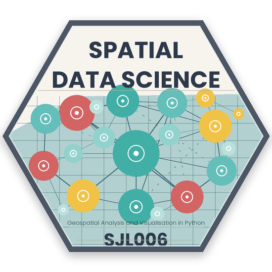

::: {.column-margin}

:::

**Data Science** is a course in the [Master of Science in Geospatial Technologies](https://mastergeotech.info/). In this course we will learn how to use Python programming language for geospatial data analysis and visualisation. The course consists of three blocks: it begins with a gentle introduction to Python and data science in general, then focuses on vector data analysis and spatial data visualisation. The aim is to apply programming skills to perform tasks without using desktop GIS, while producing the same or better results and doing so faster than traditional GIS.

