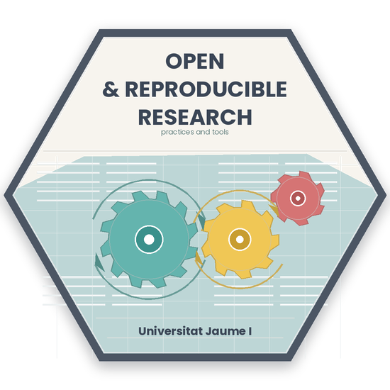

::: {.column-margin}

:::

**Open and reproducible research: practices and tools** training course is part of the [cross-disciplinary training programme of the Doctoral School at UJI](https://www.uji.es/estudis/centres/escola-doctorat/base/Formacio-transversal/). I have been teaching this course since 2020, and I have been updating the content every year: 

- [Reproducible Research Practices (academic year 2019/2020)](https://github.com/cgranell/rrp20).
- [Reproducible Research Practices (academic year 2020/2021)(https://cgranell.github.io/rrp21/), or *What can I do to make my next article (more) reproducible?*.
- [Reproducible Research Practices (academic years 2021/2022 and 2022/2023)](https://cgranell.github.io/rrp-uji/), or *What can I do to make my next article (more) reproducible?*.
- [Reproducible Research Practices (academic year 2023/2024)](https://cgranell.github.io/rrp/), or *What can I do to make my next article (more) reproducible?*. 
- [Notebooks for Academics (academic year 2023/2024)](https://cgranell.github.io/n4a/), or *Use of [Quarto](https://quarto.org/) for research and teaching documents*.
- Open and reproducible research: practices and tools (academic year 2025/2026-), that integrates the previous courses *Reproducible Research Practices* and *Notebooks for Academics* into one course.

The course is designed to be practical and hands-on, with a focus on the principles and strategies of open science and on tools and practices to make research projects and scientific and technical materials more reproducible. The aim  is to provide students with the knowledge and skills they need to conduct open and reproducible research, and to help them understand the importance of these practices in the scientific community.

